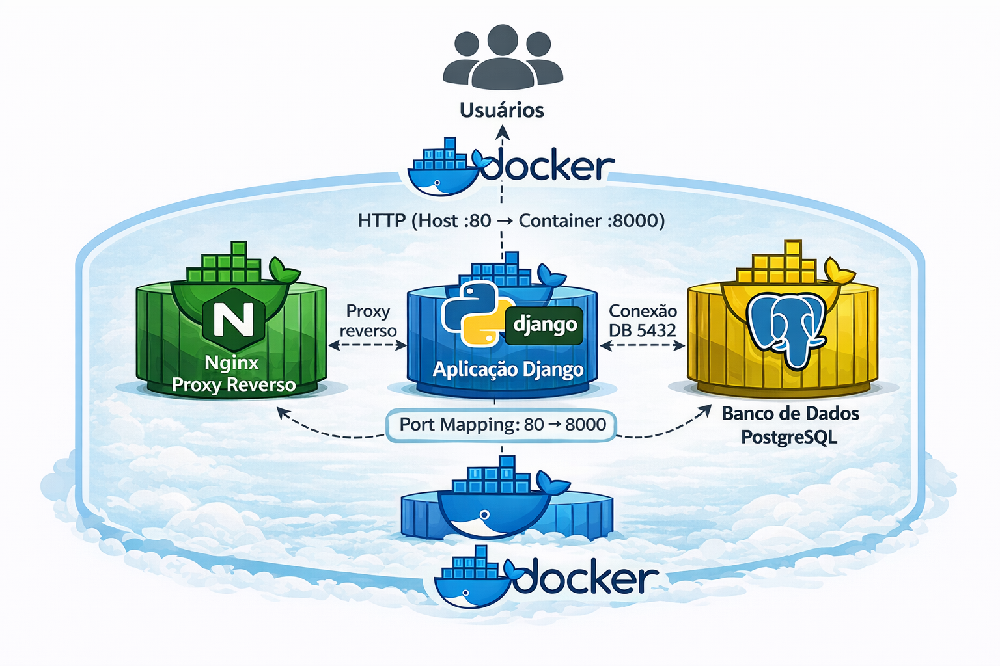

# 📲🔳 🏷️SCAPS - Sistema de Chamadas Automáticas para o SUAP

## 📋 Sobre o projeto:
Trata-se de um projeto acadêmico referente a disciplina de Seminário de Orientação ao Projeto Integrador.
O projeto consiste no desenvolvimento de uma solução para automação da presença em sala de aula.
O sistema utiliaza-se de teconologia QR para realizar a autenticação dos discentes, com o número de matricula e senha institucional.
A solução está atrelada ao Sistema Unificado de Admiministração Pública (SUAP). 

## ✅ Objetivos:
#### Otimizar o tempo destinado a frequência em sala de aula 
#### Redução de falhas humanas 
#### Foco em organização, confiabilidade e integração com sistemas institucionais

## 🤖 Teconologias e ferramentas:
### Backend e Dashboard:
####  🐍 Python
#### 📊 Django

### Banco de Dados:
🛢 PostgreSQL

### Infraestrutura:
#### 🐳 Docker
#### 🏗️ Docker Compose

### Rede e Acesso:
🌐 Nginx (proxy reverso)

## 🛠️ Composição:

